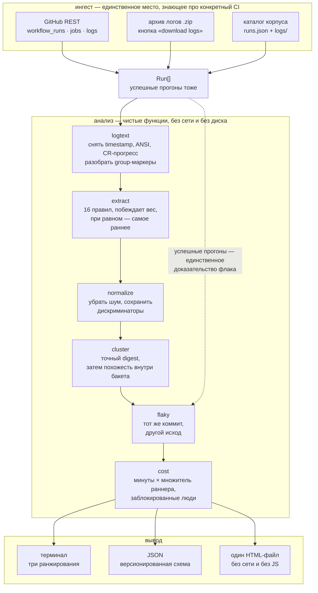

# pipeline-doctor

Инструмент, который берёт кучу упавших CI-прогонов и отвечает на два вопроса:
**во что они обошлись** и **чья это вина — кода или инфраструктуры**. Из
многомегабайтного лога он вытаскивает тот кусок, который действительно объясняет
падение, схлопывает одинаковые падения в один кластер и ранжирует кластеры по
сожжённому машинному времени, а не по числу срабатываний.

```
make demo    # разбор 255 прогонов из корпуса в репозитории, ~1 с целиком, без сети
```

---

## Задача

В любом CI, который прожил год, есть список красных сборок и нет ответа на вопрос
«что чинить первым». Стандартный дашборд считает срабатывания, и это ранжирование
почти всегда неверное. Четыре места, где оно ломается:

**Хвост лога — это не причина падения.** Последние пятьдесят строк любого
упавшего джоба — это выгрузка артефактов, сохранение кэша, `Post job cleanup` и
строчка `Process completed with exit code 1`. Причина находится выше, иногда на
несколько тысяч строк. В корпусе этого репозитория есть лог `go test -v` на 6083
строки, где ответ лежит на строках 1415–1420, а в последних пятидесяти нет ничего,
кроме слова `FAIL`.

**Одно и то же падение выглядит по-разному каждый прогон.** Другой timestamp,
другой временный каталог, другой номер горутины, другой id контейнера. Пока их не
привести к общему виду, двести прогонов одного дефекта — это двести строк в отчёте.

**Счётчик срабатываний ранжирует не то.** Двухминутный линт, упавший пятьдесят
раз, — это сто минут раннера. Сорокаминутный интеграционный джоб, убитый OOM пять
раз, — это двести минут плюс пять человек, ждавших сорок минут ради ничего.
Сортировка по количеству ставит первым линт.

**Слово «timeout» в логе — не доказательство флака.** Connection reset бывает
блипом прокси и бывает реальным багом, который рвёт сокет на кривом запросе. Лог в
обоих случаях одинаковый. Классификация по формулировке даёт число, которое
уверенно врёт, — а это хуже отсутствия числа.

Этот репозиторий — не обёртка над `grep`. Это набор правил извлечения, нормализация
с явно очерченными границами, кластеризация с защитой от ложного слияния и
классификатор флаков, который отказывается угадывать.

---

## Архитектура



Граница между ингестом и анализом проведена жёстко: `fetch` — единственная команда,
открывающая сокет, `report` и `explain` умеют работать только с каталогом на диске.
Практическое следствие описано ниже, в разделе про LLM.

---

## Что он печатает

`make demo` на вложенном корпусе. Вывод целиком, ничего не сокращено:

```
pipeline-doctor  255 runs between 2026-05-11 and 2026-06-04
  failed          75 of 255 (29%)
  distinct causes 12
  wasted          12.3h wall, 33.0h billable
  not our code    83% of billable waste (infrastructure, resource limits, timeouts)

Ranked by wasted machine time
 #   billable  share  runs people  verdict      rule                   summary
------------------------------------------------------------------------------
 1      23.0h    70%     3      1  unproven     runner-timeout         ##[error]The job running on runner GitHub Actions 29 has exce...
    6a5729de9b5a7e6f  timeout  46m/run  jobs: ui-tests-ios  05-15..05-27  3 never re-run
 2       3.4h    10%     5      3  flaky        oom-kill               ledger-worker-1 exited with code 137
    0cee1f2fff719034  resource  40m/run  jobs: integration  05-12..06-04  3 proven flaky; 2 never re-run
 3        83m     4%    14      5  reproducible pytest-summary         FAILED tests/test_billing.py::test_prorated_refund[monthly-mi...
    ac4f5e86a678d1c9  test  6m/run  jobs: unit  05-11..06-04  8 reproduced; 6 never re-run
 4        75m     4%    11      4  flaky        pytest-summary         FAILED tests/test_scheduler.py::test_lease_renewal_extends - ...
    1418657c8eb2ad73  test  7m/run  jobs: unit  05-11..06-04  7 proven flaky; 4 never re-run
 5        63m     3%     7      2  reproducible docker-build           ERROR: failed to solve: process "/bin/sh -c pip install --no-...
    0440494ad0091d0d  build  9m/run  jobs: image  05-11..06-01  6 reproduced; 1 never re-run
 6        48m     2%     4      1  reproducible gradle-failure         Execution failed for task ':ledger:test'.
    0acd7eaf7653967f  build  12m/run  jobs: jvm-tests  05-28..05-29  4 reproduced
 7        35m     2%     9      8  flaky        registry-unavailable   npm ERR! code E503
    0de97bf23522f9b3  infrastructure  4m/run  jobs: web-build  05-11..05-31  6 proven flaky; 3 never re-run
 8        29m     1%     6      2  flaky        go-test-panic          panic: send on closed channel
    db70b9b870fc7cc5  test  5m/run  jobs: go-tests  05-13..06-03  3 proven flaky; 2 reproduced; 1 never re-run
 9        24m     1%     3      1  flaky        disk-full              failed to copy files: userspace copy failed: write /var/lib/d...
    5d662fa09ae46a3b  resource  8m/run  jobs: image  05-14..05-29  1 proven flaky; 2 never re-run
10        21m     1%     4      1  reproducible go-test-fail           --- FAIL: TestReconcileLedger (0.42s)
    c3f9de03f31e8aad  test  5m/run  jobs: go-tests-verbose  05-26..06-01  2 reproduced; 2 never re-run

Same clusters, other orderings
  by occurrences     ac4f5e86a678d1c9 (14 runs), 1418657c8eb2ad73 (11 runs), 0de97bf23522f9b3 (9 runs)
  by people blocked  0de97bf23522f9b3 (8 people), ac4f5e86a678d1c9 (5 people), 1418657c8eb2ad73 (4 people)
```

Три ранжирования дают трёх разных победителей, и это главный аргумент в пользу
существования инструмента:

| Сортировка | Первый | Его позиция в других ранжированиях |
|---|---|---|
| по срабатываниям | `ac4f5e86` — тест биллинга, 14 прогонов | 3-й по деньгам |
| по заблокированным людям | `0de97bf2` — 503 от npm-реестра, 8 человек | 7-й по деньгам, 3-й по срабатываниям |
| по машинному времени | `6a5729de` — таймаут macOS, **3 прогона** | **12-й из 12** по срабатываниям |

Дашборд, отсортированный по количеству, показал бы тест биллинга. 70% бюджета
раннеров при этом сжигают три прогона macOS-джоба, которые **ни разу никто не
перезапустил**, — то есть про них даже неизвестно, воспроизводимы ли они.

### `explain` — что именно было извлечено

```
$ pipeline-doctor explain corpus 4820002679

run 4820002679#1  job go-tests-verbose  failure  ubuntu-22.04
  rule        go-test-fail (test, weight 60)
  lines       1415-1420
  summary     --- FAIL: TestReconcileLedger (0.42s)
  fingerprint c3f9de03f31e8aad
  keeps apart gotest:TestReconcileLedger, gotest:TestReconcileLedger/partial_refund
  extracted:
    | === RUN   TestReconcileLedger/partial_refund
    |     reconcile_test.go:142: partial refund not applied to the open period
    |         want: 4950
    |         got:  4500
    | --- FAIL: TestReconcileLedger (0.42s)
    |     --- FAIL: TestReconcileLedger/partial_refund (0.11s)
  normalised:
    | === RUN TestReconcileLedger/partial_refund
    | reconcile_test.go:<LINE>: partial refund not applied to the open period
    | want: 4950
    | got: 4500
    | --- FAIL: TestReconcileLedger (<DUR>)
    | --- FAIL: TestReconcileLedger/partial_refund (<DUR>)
```

Лог — 353 КиБ и 6083 строки. Шесть нужных строк лежат на 1415-й, до конца ещё
четыре с половиной тысячи строк успешных тестов.

---

## Решения и компромиссы

### Правила, а не LLM на каждый лог

Соблазн очевиден: отдать лог модели и попросить объяснить падение. Отказ основан
на трёх вещах, и только третья — про деньги.

**Логи не должны покидать периметр.** Build-лог — это, как правило, самый
чувствительный простой текст в организации: внутренние хостнеймы, имена сервисов,
пути в чужие репозитории, иногда токен, который кто-то случайно вывел в `echo`.
Согласовать инструмент, который **не умеет** открыть сокет, в разы проще, чем
инструмент, который обещает не открывать. Поэтому анализ здесь физически не
работает с сетью: `report` и `explain` читают каталог, `fetch` живёт отдельной
командой, и в рантайме у пакета ноль зависимостей — ревью «что этот код делает с
моими логами» занимает вечер, а не аудит дерева пакетов.

**Кластеризация требует детерминизма.** Отпечаток падения должен быть одинаковым
сегодня и через месяц, иначе кластеры разъезжаются и отчёт перестаёт сравниваться
сам с собой. Регулярка это гарантирует, генеративная модель — нет; тот же лог с
temperature 0 всё ещё не даёт побайтового совпадения между версиями модели. А
кластеризация, которая на второй неделе разбивает один дефект на три, хуже
отсутствия кластеризации: она создаёт три задачи в трекере.

**Объём.** В этом корпусе 75 упавших прогонов дают 1.81 МиБ логов — примерно
0.5 млн токенов только на вход, и это стенд. Организация с десятью тысячами
упавших прогонов в месяц отправляла бы порядка 60 млн входных токенов ежемесячно
на задачу, которая здесь занимает 372 мс CPU на весь корпус. Умножать это на
конкретный прайс я не буду — цены меняются, и число в README устареет раньше
репозитория; порядок величины виден и без него.

Что LLM здесь действительно хороша и куда её стоит поставить: не в извлечение, а
в **объяснение уже собранного кластера**. Двенадцать кластеров в месяц — это
двенадцать вызовов на компактном спане в 6–20 строк, а не 75 вызовов на
многомегабайтных логах. Такой шаг не сделан, потому что он не нужен для ответа на
вопрос «что чинить первым», а не потому, что он плох.

### Вес правил: OOM важнее теста, который он уронил

Правил шестнадцать, у каждого есть вес. Когда в логе срабатывает несколько,
побеждает наибольший вес; при равном весе — **самое раннее** совпадение.

Вес — это порядок над *причинами*, а не над специфичностью регулярки. Если раннер
получил OOM, то `AssertionError` тремя строками выше — симптом: чинить надо память.
Поэтому `oom-kill` (100) и `disk-full` (92) стоят выше `registry-unavailable` (90)
и таймаута (86), а те — выше сборки, тестов и зависимостей (56–70). Родовое
`##[error]` идёт под 34, а `Process completed with exit code N` — под 10, чтобы
никогда не выиграть у правила, которое реально что-то опознало.

Цена этого решения названа явно: прогон, где одновременно был настоящий упавший
тест и блип реестра, будет отнесён к инфраструктуре. Компромисс сознательный —
альтернатива (несколько причин на прогон) ломает арифметику стоимости, потому что
одни и те же минуты пришлось бы посчитать дважды, и в отчёте появились бы кластеры
с дробными срабатываниями.

Правило «при равном весе побеждает раннее» — из того же соображения: первое, что
сломалось, и есть причина, всё после — следствие. На это есть отдельный тест: лог с
двумя `--- FAIL` подряд обязан назвать первый.

### Границы спана берутся из маркеров, а не из «N строк вокруг»

Окно фиксированной ширины вокруг совпадения — самый быстрый способ получить
отпечаток, который течёт. Поэтому у правил есть `open_marker` и `close_marker`:
для buildkit это строка `> [builder 5/8] RUN ...`, которую он сам печатает перед
разбором ошибки, для pytest — баннер `short test summary info` и строка с итогами,
для Go — `=== RUN`, открывший упавший кейс. Фиксированное окно осталось
запасным вариантом, а не механизмом.

Отдельно спан подрезается секцией `##[group]`, если совпадение попало внутрь неё:
без этого поиск `open_marker` назад уходил бы в предыдущий шаг. Тест
`test_a_span_does_not_leak_out_of_its_group` строит ровно эту ловушку — прогретую
сборку кэша выше упавшей.

У pytest вес `pytest-summary` (62) выше, чем у `pytest-traceback` (56), намеренно:
собственный краткий итог pytest стабилен, а трейсбек тащит локальные значения и
абсолютные пути, которые меняются каждый прогон и раскалывают кластер. Трейсбек
используется, только когда итога нет (`-r ""`), и это отдельная фикстура.

### Что нормализация специально **не** трогает

Интересная половина нормализации — не список того, что вычищается, а список того,
что оставлено.

**Не вычищаются:** коды возврата (137 — это не «какой-то ненулевой»), HTTP-статусы
(503 от реестра и 404 на опечатку в имени пакета — разные задачи для разных людей),
версии пакетов (`@ridgeline/ui-tokens@3.4.0` против `@4.0.1` — разный баг), имена
тестов, классы исключений, значения `assert`, настроенный лимит таймаута
(«45 минут» — это конфиг джоба, а не измерение; два джоба с разными лимитами не
одно падение).

**Вычищается:** timestamps, длительности в секундах, UUID, sha256 и длинные hex,
адреса `0x…`, номера горутин и pid, IP и порты, префикс воркспейса раннера
(`/home/runner/work/<repo>/<repo>/`), временные каталоги, номера строк в ссылках
вида `файл.py:118`, посекундные префиксы buildkit.

Два вычищения адресные, и это принципиально. Счётчики тестов (`411 passed`,
`Tests run: 38, Failures: 1`) меняются, как только кто-то добавил тест, и
нормализуются **только на строке итогов** — а не сплошным вырезанием всех целых
чисел, которое заодно стёрло бы `137` и `503`. То же с секундами: `4.182 seconds`
превращается в `<DUR>`, а `45 minutes` — нет.

Проверяется это двумя таблицами в `tests/test_normalize.py`: одна перечисляет
пары, которые **обязаны** схлопнуться, вторая — пары, которые **обязаны** остаться
разными. Вторая длиннее.

### Похожесть решает «шум ли это», дискриминаторы решают «тот ли это баг»

Кластеризация в два прохода. Первый — точное совпадение отпечатка, и он делает
основную работу: на корпусе 75 упавших прогонов дают 51 различный отпечаток. Вот
где именно нормализации хватило, а где нет:

| кластер | прогонов | различных отпечатков после нормализации |
|---|---|---|
| `panic: send on closed channel` | 6 | **1** — номера горутин и адреса ушли полностью |
| падение теста биллинга | 14 | **1** |
| падение теста планировщика | 11 | **11** |
| таймаут macOS | 3 | 3 |
| ошибка docker build | 7 | 7 |

Одиннадцать из одиннадцати у планировщика — потому что в сообщении стоит
`assert datetime(2026, 5, 14, 9, 15, 2, 481233) > datetime(..., 481240)`. Такое
нормализацией не поймать: писать регулярку под `repr` каждого типа Python — это
бесконечная работа, которая всё равно опоздает на следующий тип. Этим занимается
второй проход — сравнение по похожести.

И здесь начинается место, где инструмент кластеризации либо оправдывает себя, либо
теряет доверие. Похожести **недостаточно**. Два соседних теста в одном файле
отличаются десятком символов: измеренная похожесть их нормализованных спанов —
**0.9803**. Любой порог, при котором склеиваются варианты одного бага (у меня
0.88), склеит и их — а это уже не косметика, это два разных дефекта в одной строке
отчёта, с чужой стоимостью и чужим счётчиком людей.

Поэтому из спана дополнительно вытаскиваются **дискриминаторы** — токены, которые
обязаны совпадать точно, прежде чем слияние вообще рассматривается: node id теста
pytest, имя Go-теста, класс исключения, HTTP-статус, код npm и имя пакета, код
возврата, имя Gradle-таски, Maven-цель, команда упавшего шага Docker. У тех двух
тестов дискриминаторы разные — они не сольются ни при каком пороге, и на это есть
тест с `threshold=0.5`.

Честная оговорка: на вложенном корпусе дискриминаторы результат **не меняют** —
похожесть сама по себе даёт те же 12 кластеров, потому что заложенные в корпус
падения текстуально далеки друг от друга (503 против ETARGET дают 0.3832). Защита
нужна не для этого корпуса, а для реального, где в одном файле лежит сорок тестов;
доказывается она юнит-тестами, а не демо.

Слияние транзитивно (union-find), а бакеты по паре «категория + дискриминаторы»
держат квадратичное сравнение маленьким; на всякий случай есть потолок размера
бакета, чтобы патологический ворох неопознанных падений не превратил отчёт в
двухминутное ожидание.

### Флак требует доказательства, а не формулировки

Единственное, что доказывает флак, — **тот же код, ведущий себя по-разному**.
Поэтому классификатор смотрит только на исходы одного и того же джоба на одном и
том же коммите:

* прошёл и упал → **flaky**, и в отчёте назван прошедший прогон;
* упал больше одного раза → **reproducible**, и назван повторный;
* прогонялся один раз → **unproven**, и так и остаётся.

Третья корзина — не провал классификатора, а находка о проекте: если половина
падений не имеет вердикта, значит, в команде никто ничего не перезапускает, и
отличить баг от флака попросту нечем. Заполнить её догадкой было бы хуже.

Из этого следуют две вещи, которые видно в коде. Успешные прогоны **ингестятся и
проносятся через весь конвейер**, хотя в отчёте не появляются никогда: без них
доказательство невозможно. И единицей анализа является **джоб, а не workflow run** —
зелёный `lint` на том же коммите ничего не говорит про красный `unit`; на каждое из
этих двух правил есть отдельный тест.

Вердикт кластера при ничьей уходит в сторону флака: падение, которое хоть раз
наблюдалось проходящим на том же коммите, нельзя считать надёжным гейтом, даже
если обычно оно воспроизводится. Смешанные кластеры при этом не прячутся за
ярлыком — в строке отчёта стоит разбивка вида `3 proven flaky; 2 reproduced;
1 never re-run`.

### Ранжирование по машинному времени, и почему его недостаточно

Основная метрика — минуты раннера, умноженные на множитель стоимости
(Linux 1, Windows 2, macOS 10 — это множители биллинга GitHub, а не выдумка).
Потраченным считается **весь прогон**: он не выдал ни артефакта, ни вердикта, и
его придётся повторить целиком. Считать только время после точки падения было бы
приятнее и неправдой.

Именно эта метрика вытаскивает наверх macOS-джоб: три падения по 46 минут на
множителе 10 дают 23 часа — 70% всего бюджета, при том что по количеству это
предпоследнее место.

Но одного числа мало, и композитного «скора» в отчёте нет намеренно. Взвешенная
сумма минут и людей выглядит научно и не имеет смысла: коэффициенты берутся с
потолка, а читатель не может проверить вывод. Поэтому печатаются три ранжирования
рядом, и то, что они расходятся, — это информация, а не шум. Медленный ночной джоб
жжёт деньги, не блокируя никого; быстрое падение на общей ветке блокирует всех.

Строка `not our code` (доля инфраструктуры, лимитов и таймаутов в потраченном
времени) вынесена в шапку по одной причине: она решает, с кем вообще говорить
дальше. На корпусе это 83% — разговор с владельцем раннеров, а не с командой,
у которой красные тесты.

### Провайдер — это адаптер, и ничего кроме

Всё, что знает про конкретный CI, лежит в `pipeline_doctor/sources/`. Остальной
пакет видит только `Run`. GitLab или Jenkins — это модуль размером с
`github_actions.py` минус работа с zip-архивом.

Разбор REST-ответов вынесен в чистые функции над словарями и проверяется на
записанных payload-ах офлайн. Тест, который ходил бы в живой API, проверял бы
сеть: он краснеет от rate limit и зеленеет на закешированном ответе, то есть не
проверяет ничего. Что при этом действительно ломается при изменении API — какие
ключи читаются и что происходит, когда ключа нет, — зафиксировано (`head_sha`,
`started_at`, неизвестный `conclusion`, job без упавшего шага).

Файловый корпус принимает и обычный `.log`, и **zip прямо с кнопки «download
logs»**: инженер может отдать инструменту архив, не выдавая ему токен вообще.
Имена участников архива GitHub санирует (`build / linux` → `build  linux`), это
учтено и покрыто тестом.

### Корпус синтетический, лежит в репозитории, и CI сверяет его с генератором

Реальные логи принадлежат тем, кто их собрал, и полны внутренних имён —
публичный репозиторий не может привезти настоящую выгрузку. Что он может — привезти
корпус, воспроизводящий формы, которые извлекателю приходится переживать: причину
на 1415-й строке из 6083, teardown длиннее самого падения, один и тот же дефект с
новым номером горутины каждый прогон, ретраи, доказывающие флак в обе стороны.

Корпус **закоммичен**, чтобы `make demo` не требовал шага генерации, и ровно
поэтому он может разъехаться с генератором. Отдельный шаг CI собирает его заново и
делает `diff -r`. Всё в генераторе засеяно фиксированным seed-ом, включая
timestamp внутри zip-архива, — сборка побайтово одинакова на любой машине.

### Мелочи, за которыми стоит решение

* **Ноль рантайм-зависимостей.** Ни click, ни jinja, ни requests. Аргумент из
  первого раздела: инструмент, читающий чужие логи, должен читаться целиком.
  Цена — argparse вместо click и конкатенация строк вместо шаблонов; и то и другое
  здесь стоит дёшево.
* **Вывод терминала — чистый ASCII без цвета.** Отчёт чаще попадает в тикет или
  чат, чем читается в терминале; escape-последовательности не переживают ни того,
  ни другого. Многоточие тоже ASCII — кодировку принимающего клиента предсказать
  нельзя. Это проверяется тестом.
* **HTML — один файл без JS и без единого внешнего запроса.** Прогрессивное
  раскрытие сделано на `<details>`, тёмная тема — на CSS-переменных. Страница
  открывается из артефактов CI, из файлового шара и из-за прокси, который режет
  всё; каждый из этих сценариев ломает страницу, тянущую шрифт при загрузке.
  Отдельный шаг CI ищет в отчёте `<script>`, `<link>`, ` src=`, `@import` и `url(`
  и падает, если что-то нашлось.
* **Неопознанное падение помечается как неопознанное.** Если не сработало ни одно
  правило, берётся хвост и пишется `no rule matched, showing the tail` — вместе с
  кодом возврата. Растущий кластер `unclassified-tail` — это сигнал «пора написать
  правило», а не тихая ошибка.
* **Схема JSON версионирована и намеренно плоская.** Потребители — панель в
  Grafana, джоб, заводящий задачу на верхний кластер, и diff отчёта с прошлой
  неделей. Все три ломаются о схему, которая переезжает.
* **Показывается спан самого свежего прогона кластера, а не первого.** Читатель
  всё равно пойдёт смотреть последний; спан трёхнедельной давности, цитирующий
  переименованный с тех пор файл, читается как баг в инструменте.

---

## Метрики

Все числа получены запуском на этой машине (Python 3.11.9, Windows 11); команды
приведены, воспроизводятся `make bench` и `make demo`.

### Скорость — `make bench`

```
corpus            corpus
runs              255 (75 failed)
log volume        1.81 MiB, 30829 lines
ingest            33 ms  (read and parse every log)
extract only      225 ms
extract + hash    249 ms
full analysis     372 ms  (adds clustering, evidence, cost)
largest log       353 KiB, 6083 lines -> 37.9 ms
throughput        8 MiB/s extracted
```

8 МиБ/с — это шестнадцать правил, прогоняемых по каждой строке, и оптимизацией
никто не занимался: на реальных объёмах (десятки тысяч прогонов) узкое место —
скачивание логов, а не их разбор. Кластеризация масштабируется по числу
*различных* падений, а оно остаётся маленьким независимо от числа прогонов.

### Схлопывание

| | значение |
|---|---|
| упавших прогонов | 75 |
| различных отпечатков после нормализации | 51 |
| кластеров после прохода по похожести | **12** |
| заложено в корпус различных падений | 12 |

Двенадцать заложенных, двенадцать полученных: ни одного ложного слияния и ни
одного расколотого кластера. Это утверждение — тест
(`tests/test_corpus.py::test_the_corpus_collapses_to_twelve_distinct_failures`),
а не наблюдение.

### Тесты

```
$ make test
207 passed
```

Что именно они проверяют:

| файл | о чём |
|---|---|
| `test_extract.py` | 16 фикстур, по одной на правило: какое правило победило, первая и последняя строка спана, и строка, которой в спане **быть не должно** |
| `test_normalize.py` | таблица «обязано схлопнуться» против таблицы «обязано остаться разным» |
| `test_cluster.py` | слияние почти-дубликатов, транзитивность и пять сценариев ложного слияния |
| `test_flaky.py` | сконструированные истории прогонов: ретрай прошёл, ретрай упал, другой коммит, другой джоб, другой workflow |
| `test_cost.py` | арифметика, множители раннеров и инверсия ранжирования |
| `test_github_actions.py` | форма REST-payload и раскладка zip-архива, офлайн |
| `test_files_source.py` | формат корпуса и сообщения об ошибках |
| `test_report.py` | три рендерера, экранирование, пустые состояния |
| `test_corpus.py` | сквозной разбор вложенного корпуса |

`ruff` и `mypy --strict` зелёные на пакете, скриптах **и тестах**: фикстура,
переставшая проходить проверку типов, — это фикстура, отставшая от кода.

---

## Где подход ломается

Названо явно, потому что «работает на стенде» и «работает у вас» — разные
утверждения.

* **Корпус синтетический.** Он собран так, чтобы воспроизвести формы реальных
  логов, но это стенд, а не выгрузка из чужого CI. Правила проверялись против него
  и против шестнадцати фикстур, а не против годовой истории живого проекта.
* **Одна причина на прогон.** Прогон, в котором был и настоящий упавший тест, и
  блип реестра, попадёт в инфраструктуру целиком. Это следствие того, что минуты
  нельзя посчитать дважды.
* **Правило есть только под то, что кто-то видел.** Шестнадцать правил покрывают
  pytest, Go, npm, Maven, Gradle, Docker/buildkit, OOM, диск, 5xx реестра, таймаут
  и родовые аннотации GitHub. Rust, .NET, Bazel и всё остальное свалится в
  `exit-code` или в хвост — честно помеченный, но бесполезный для группировки.
* **Таймауты — самый рыхлый бакет.** У них обычно нет дискриминаторов, кроме кода
  возврата, поэтому два разных таймаута защищены только похожестью текста.
* **`people_blocked` — это поле actor.** Для прогонов, запущенных ботом или
  расписанием, там будет бот, и человеческая цена окажется занижена.
* **Множители раннеров зашиты для трёх платформ.** Self-hosted и «larger runners»
  считаются как 1.0, то есть их время недооценивается.
* **`fetch` против живого API не проверялся.** Он покрыт тестами только на
  записанных формах ответов; про пагинацию, rate limit и истёкшие архивы логов на
  реальном репозитории здесь ничего утверждать нельзя.
* **Стоимость — это машинное время, а не деньги.** Перевод в валюту зависит от
  тарифа, self-hosted парка и того, считать ли рабочее время инженера; инструмент
  сознательно останавливается на минутах.

---

## Быстрый старт

Нужен только Python 3.11+. Зависимостей в рантайме нет.

```bash
git clone https://github.com/lpogosu/pipeline-doctor
cd pipeline-doctor

make demo                  # разбор вложенного корпуса, JSON и HTML в out/
make report                # то же плюс извлечённые фрагменты логов в терминале
make test                  # 207 тестов, офлайн
make ci                    # ruff + mypy --strict + pytest
```

Свой CI:

```bash
export GITHUB_TOKEN=...    # только для fetch
pipeline-doctor fetch acme/service --workflow ci.yml --limit 300 --out corpus-live
pipeline-doctor report corpus-live --top 15 --html report.html
```

`fetch` складывает архивы логов и `runs.json` в каталог; дальше сеть не нужна ни
разу. Каталог с чужими логами не место в git — `corpus-*/` уже в `.gitignore`.

Разобрать один прогон:

```bash
pipeline-doctor explain corpus-live 4820002679 --attempt 1
```

### Цели Makefile

| Цель | Что делает |
|---|---|
| `demo` | разбор корпуса, отчёты в `out/report.json` и `out/report.html` |
| `report` | то же с `--spans`: печатает извлечённые фрагменты |
| `test` / `lint` / `typecheck` | pytest, ruff, mypy --strict (пакет, скрипты, тесты) |
| `ci` | всё, что гоняет пайплайн |
| `corpus` | пересобрать вложенный корпус из шаблонов |
| `bench` | замеры ингеста, извлечения и полного анализа |
| `clean` | убрать отчёты и кэши инструментов |

Интерпретатор задаётся переменной: `make test PYTHON=python3.12`.

---

## Структура

```
pipeline_doctor/
  logtext.py           снятие декораций раннера и разбор ##[group]
  rules.py             таблица из 16 правил: якорь, маркеры границ, вес
  extract.py           выбор победившего спана
  normalize.py         нормализация и извлечение дискриминаторов
  cluster.py           точное совпадение, затем похожесть внутри бакета
  flaky.py             вердикт по исходам одного коммита
  cost.py              минуты, множители раннеров, три ранжирования
  analysis.py          сборка конвейера, без сети и без диска
  sources/             всё, что знает про конкретный CI
    github_actions.py  REST-формы, zip-архив логов, HTTP-клиент
    files.py           каталог корпуса: runs.json + logs/
  report/              терминал, JSON, самодостаточный HTML
corpus/                255 прогонов, 75 упавших, 12 заложенных падений
scripts/
  build_corpus.py      генератор корпуса, засеян фиксированным seed
  bench.py             замеры для раздела «Метрики»
tests/fixtures/logs/   16 фикстур, по одной на правило
```

## Что проверяет CI

| Job | Что делает |
|---|---|
| `quality` | ruff, mypy --strict, pytest на Python 3.11 и 3.12 |
| `demo` | прогон `make demo`; сверка закоммиченного корпуса с пересобранным; проверка, что HTML ничего не тянет из сети |

---

## Лицензия

MIT — см. [LICENSE](LICENSE).
